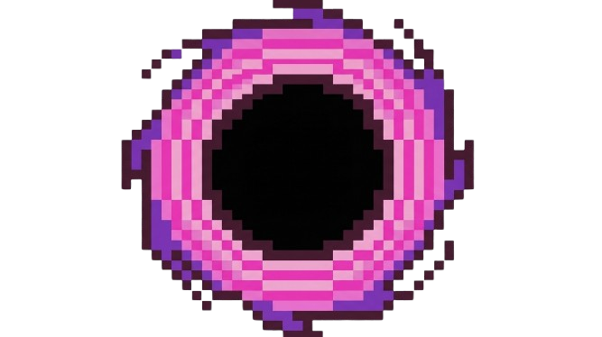
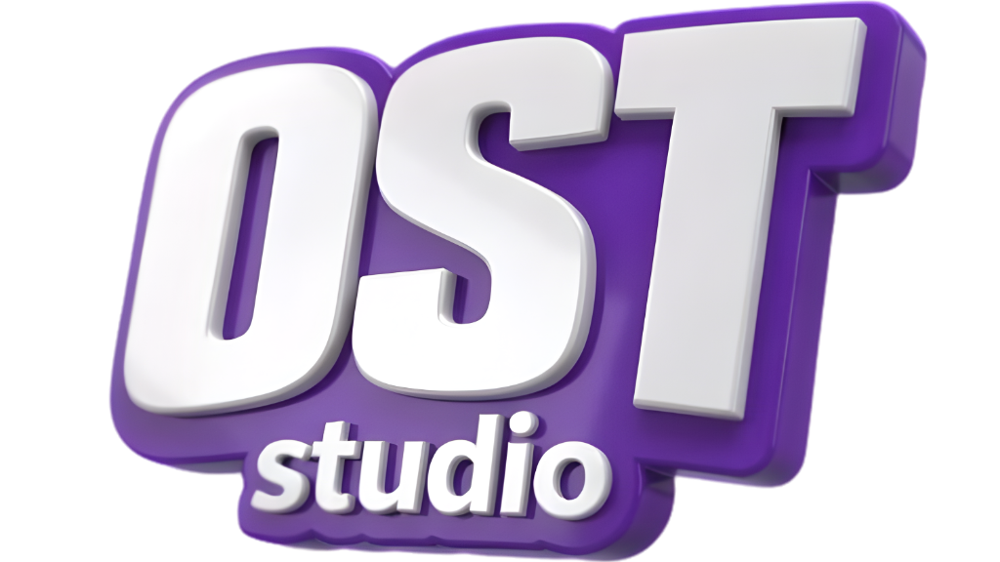
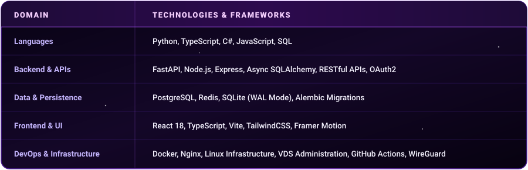

  

    

  

    

  
  
  
  

   

  
  
  
  

---

As a System Architect and Full-Stack Engineer, I specialize in architecting distributed backend services, high-throughput microservices, containerized deployments, and automated release pipelines.

* **Architectural Strategy:** Decoupled edge clients (e.g., Discord daemons, desktop clients) act strictly as operational interfaces. Business logic, state management, and data persistence are encapsulated within authoritative **FastAPI + PostgreSQL** microservices.
* **Infrastructure & VDS Management:** Production-grade deployments leverage **Linux infrastructure**, **Docker Compose** orchestration, **Nginx** reverse proxying, **systemd** process supervision, and zero-downtime runtime configurations.
* **Security & Performance Optimization:** Implementation of OAuth2 authentication, Redis caching layers, SQLite WAL modes for edge storage, custom protocol handling, and packet obfuscation techniques.

---

  

### [OST Studio](https://oststudio.net/) — *Flagship Distributed Ecosystem*
An end-to-end multi-tenant platform unifying multi-instance Discord services, full-stack administration panels, and real-time economy/XP telemetry under a consolidated backend architecture.

* **Frontend:** React 18, TypeScript, Vite, TailwindCSS, Framer Motion
* **Backend & API:** FastAPI, Async SQLAlchemy, OAuth2 Session Management
* **Data Management:** PostgreSQL with Alembic schema migration pipelines, SQLite WAL mode at edge nodes
* **DevOps & Orchestration:** Docker Compose, Linux VDS Administration, Nginx Reverse Proxy, GitHub Actions CI/CD automation for release artifacts (e.g., PyInstaller / Inno Setup builds)

---

### [Dust-vpn](https://github.com/Dust-exe/Dust-vpn) — *Open-Source Windows VPN Client*
An open-source desktop client built for managing custom WireGuard and AmneziaWG servers.

* **Key Features:** Advanced packet obfuscation algorithms, real-time bandwidth telemetry monitoring, system tray daemon integration, and native `dust://` custom protocol handler registration.
* **Core Stack:** Python, WireGuard Engine, AmneziaWG Core, Windows System APIs

---

### [DustFX](https://github.com/Dust-exe/DustFX) & [DustReplay](https://github.com/Dust-exe/DustReplay)
* **DustFX:** Modular C# framework for high-throughput FX processing and performance optimization.
* **DustReplay:** Python-driven event telemetry parser and automated action replay analysis engine.

---

  

 

---

  
  

    

  

---

  **[dust-studio.com](https://dust-studio.com/)** &nbsp;•&nbsp; **[dustexee@gmail.com](mailto:dustexee@gmail.com)** &nbsp;•&nbsp; **[Discord Community](https://discord.gg/E8K6rczdb2)**

  Engineered by Kaan (dust.exe)

